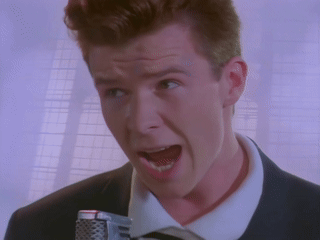

# cascaler

**Transform your media with intelligent content-aware scaling.**

A high-performance .NET CLI tool that applies seam carving (liquid rescaling) to images and videos. Process single files, entire directories, or generate creative video effects—all with parallel processing and a clean command-line interface.

[](https://dotnet.microsoft.com/download)
[](https://ffmpeg.org/)
[](LICENSE)

<div align="center">
  <a href="https://www.youtube.com/watch?v=dQw4w9WgXcQ"></a>
  <br>
  <em>Click to watch demo video</em>
</div>

## Why cascaler?

**Content-aware scaling** intelligently resizes media by removing or adding pixels based on content importance. Unlike traditional scaling that distorts images, seam carving preserves important features while adjusting dimensions.

### Key Features

- **Batch Processing** - Process entire directories in parallel with up to 64 threads
- **Video Support** - Extract, process, and encode video frames with full audio preservation
- **Gradual Scaling** - Create smooth transitions from one scale to another over time
- **Audio Effects** - Apply vibrato and tremolo filters for creative audio manipulation
- **Scale-Back Mode** - Apply liquid rescaling effects while maintaining original dimensions
- **Flexible Output** - Generate frame sequences, videos, or processed images
- **HDR Support** - Automatically detects and preserves HDR10/HLG color metadata
- **Persistent Configuration** - Save your preferred settings for consistent results

### What You Can Do

✨ **Resize images intelligently** without distorting important content
🎬 **Process videos** with frame-accurate trimming and audio sync
📁 **Batch process** hundreds of images in seconds
🔄 **Create effects** with gradual scaling transitions
🎵 **Add audio effects** with built-in vibrato and tremolo filters
⚙️ **Customize everything** with persistent configuration or per-command options

## Quick Start

### Requirements

- .NET 10.0 or higher
- FFmpeg 7.x libraries (for video processing)

### Installation

```bash
# Clone and build
git clone https://github.com/nathanpbutler/cascaler.git
cd cascaler
dotnet build

# Install FFmpeg (if not already installed)
brew install ffmpeg@7              # macOS
sudo apt install ffmpeg            # Linux
# Windows: Download from https://www.gyan.dev/ffmpeg/builds
```

For detailed FFmpeg setup instructions, see [Configuration Guide](Documentation/Configuration.md#ffmpeg-section).

## Usage Examples

### Basic Image Processing

```bash
# Scale a single image to 50% (default)
cascaler input.jpg

# Scale to specific dimensions
cascaler input.jpg -w 800 -h 600

# Process an entire directory
cascaler /path/to/images -p 75
```

### Video Processing

```bash
# Process a video (preserves audio)
cascaler input.mp4 -o output.mp4 -p 75

# Trim and process a video segment
cascaler input.mp4 -o output.mp4 --start 10 --duration 5 -p 50

# Add audio effects
cascaler input.mp4 -o output.mp4 --vibrato -p 75
```

### Creative Effects

```bash
# Gradual scaling effect (100% → 50%)
cascaler input.mp4 -o output.mp4 -sp 100 -p 50

# Image to video with gradual scaling
cascaler input.jpg -o output.mp4 --duration 3 -sp 100 -p 50

# Apply effect and scale back to original size
cascaler input.jpg --scale-back -p 50

# Convert directory to video with gradual scaling
cascaler /path/to/images -o output.mp4 -sp 75 -p 25
```

For complete command-line reference and advanced usage, see [Command-Line Reference](Documentation/CommandLineReference.md).

## Common Options

| Option | Alias | Description |
|--------|-------|-------------|
| `--percent` | `-p` | Scale percentage (default: 50) |
| `--width` / `--height` | `-w` / `-h` | Target dimensions in pixels |
| `--start-percent` | `-sp` | Starting percentage for gradual scaling |
| `--output` | `-o` | Output path (file or directory) |
| `--threads` | `-t` | Number of parallel processing threads (default: 16) |
| `--duration` | - | Duration in seconds (for image sequences) |
| `--fps` | - | Frame rate for sequences (default: 25) |
| `--vibrato` | - | Apply vibrato and tremolo audio effects |
| `--scale-back` | - | Scale back to original 100% dimensions |

For a complete list of options, see [Command-Line Reference](Documentation/CommandLineReference.md).

## Configuration

Save your preferred settings to avoid repeating command-line options:

```bash
# Initialize configuration with FFmpeg detection
cascaler config init --detect-ffmpeg

# View current configuration
cascaler config show

# Show config file location
cascaler config path
```

**Configuration file location:**

- Unix/macOS/Linux: `~/.config/cascaler/appsettings.json`
- Windows: `%APPDATA%\cascaler\appsettings.json`

**Example configuration:**

```json
{
  "Processing": {
    "MaxImageThreads": 32,
    "DefaultScalePercent": 75,
    "DefaultFps": 30
  },
  "VideoEncoding": {
    "DefaultCRF": 20
  },
  "Output": {
    "Suffix": "-scaled"
  }
}
```

Settings priority: Embedded defaults → User config → Command-line arguments

For detailed configuration options and examples, see [Configuration Guide](Documentation/Configuration.md).

## Supported Formats

**Input:**

- Images: `.jpg`, `.png`, `.gif`, `.bmp`, `.tiff`, `.webp`, `.ico`
- Videos: `.mp4`, `.avi`, `.mov`, `.mkv`, `.webm`, `.wmv`, `.flv`, `.m4v`

**Output:**

- Videos: `.mp4`, `.mkv` (H.264 encoding with AAC audio)
- Frames: `png` (default), `jpg`, `bmp`, `tiff`

## How It Works

cascaler uses **seam carving** (also known as liquid rescaling or content-aware scaling) to intelligently resize media. Instead of uniformly scaling pixels, it identifies and removes (or adds) "seams" - paths of pixels with low visual importance.

**Key technologies:**

- **ImageMagick.NET** for content-aware liquid rescaling
- **FFmpeg.AutoGen 7.1.1** for video/audio processing with direct API access
- **Parallel processing** with configurable thread pools (16 threads for images, 8 for video frames)
- **Frame-accurate** video trimming and audio synchronization

For technical details and architecture, see [Architecture Documentation](Documentation/Architecture.md).

## Documentation

- **[Command-Line Reference](Documentation/CommandLineReference.md)** - Complete guide to all command-line options and usage patterns
- **[Configuration Guide](Documentation/Configuration.md)** - Persistent configuration setup, FFmpeg path detection, and advanced settings
- **[Architecture Documentation](Documentation/Architecture.md)** - Technical overview, processing flows, and implementation details

## Contributing

Contributions are welcome! Please feel free to submit issues, feature requests, or pull requests.

## License

MIT License. See [LICENSE](LICENSE) for details.
